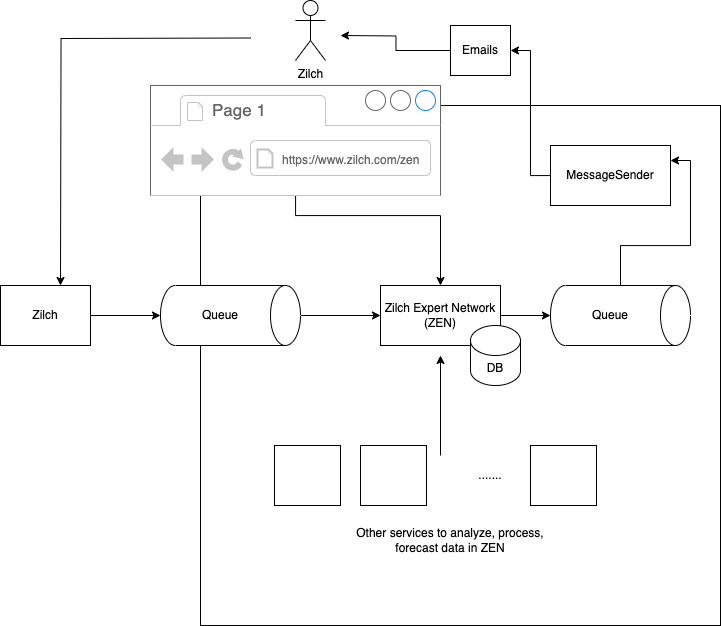

# Zilch Expert Network (ZEN)

The system aims to support Zilch mission in helping people within
`Buy Now, Pay Later` (BNPL) domain by empowering users with knowledge,
tools, and insights to make informed and responsible financial decisions. 

More about ZEN vision and planned functionality can be found in [vision](documentation/business/vision.md).

# Repository structure

* Services:
 * core (handles events from zilch, can be used as central point for other services to enrich it with data and )
 * message-sender (sends messages on different distribution channels)
 * e2e (mostly for e2e testing)
* Documentation (written in markdown, technical and product files)
* environment (place meant to store things for local env setup, not fully used, yet)

# How to run?

Use [environment.sh](environment.sh) to start database (for zen-core), kafka (shared for both services) and flagd (feature flags distributed system, global management).
NOTE: Please ru script from the same directory as script

Then please start (for example from Intellij) both Spring boot apps (zen-core[core](services/core) and [messagesender](services/messagesender))

You can then run [e2e tests](services/e2e/e2e-tests/src/test/java) to check if simple flow between zen-core and message sender services.

# Message to reviewers

Implementing whole system sounds like a lot of fun but unfortunately due to limited time resources
I have implemented only a small subset of it. 

What was done?
- Prepared some product vision for product named Zilch Expert Network (aka ZEN)
- Simple event consumption from "Zilch" to Zilch Expert Network over kafka about user creations, purchases and payments
- Save creations, purchases and payments in DB and process with sending event to message sender over kafka to send some notification to user
- Mocked message sending by putting things into kafka as well (wanted to setup some simple local SMTP server but did not have time...)
- Used flagd with open feature specification (https://openfeature.dev/specification/) to check if mail message can be sent to given email recipient (allowlisting)
- Used chain of responsibility in email processing (https://commons.apache.org/dormant/commons-chain/)
- Setup local environment with simple scripting (unfortunately docker compose does not work fully as I wanted...)
- Added integration tests in zen-core (springboot tests with test containers for kafka and postgres) and e2e test to test flow between zen-core and message sender services

What will be nice to do? A lot of things... Some things:
- changelog
- more tests (unit and integration tests for message sender)
- logging
- refactor business model for purchases and payments
- add some API for web/app user clients
etc. etc. But it could be thing of our discussion ;)

Simple overview on diagram:

